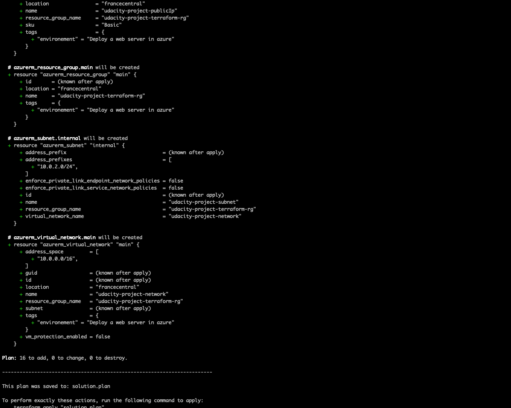

# Azure Infrastructure Operations Project: Deploying a scalable IaaS web server in Azure

### Introduction
For this project, you will write a Packer template and a Terraform template to deploy a customizable, scalable web server in Azure.

### Getting Started
1. Clone this repository

2. Create your infrastructure as code (IAAS)

3. Create a policy ’tagging-policy’ that denies creation of resources that do not have tags
4. Create a resources group

### Dependencies
1. Create an [Azure Account](https://portal.azure.com)
2. Install the [Azure command line interface](https://docs.microsoft.com/en-us/cli/azure/install-azure-cli?view=azure-cli-latest)
3. Install [Packer](https://www.packer.io/downloads)
4. Install [Terraform](https://www.terraform.io/downloads.html)

### Instructions
After having dependencies, we need following tools to deploy a scalable web server in azure.

1. packer to deploy the image
2. terraform to deploy the infrastructure by using  a template.

#### Packer image
Packer is an open source tool that automates the creation of any type of images for multiple platforms from a single source configuration.
Once we deployed the virtual machine with the help of packer, make sure to delete the paker image because does not maintain the state.

- Config Variables of Environment
Go to the terminal and export the environment variables like below.
```
export ARM_CLIENT_ID=4685768f-1912-fake-cliend_id
export ARM_CLIENT_SECRET=6GNB5c5p_5H_fake-secret_id
export ARM_SUBSCRIPTION_ID=59ce2236-a13-fakesubsribtionid
```
  - SUBSCRIPTION ID

    - Login into your azure account
    - Search and click "Subscriptions"
    - Select whichever subscriptions are needed
    - Click on the overview
    - Copy the Subscription Id
  - CLIENT ID

   - Login into your azure account
   - Search and click "Azure Active Directory"
   - Click "App registrations" under the Manage tab
   - Click the application that you own
   - Copy the client ID
  - CLIENT SECRET
   - Login into your azure account
   - Search and click "Azure Active Directory"
   - Click "App registrations" under the Manage tab
   - Click the application that you own
   - Click the "Certificates & Secrets" under the Manage tab
   - Create a client secret as you need.
After these process type printenv to check tou have configured properly
- Deploy packer images
Type the following command to build the server with packer template

 `packer buid server.json`

### Create azure resources with terraform template
Terraform is an open-source infrastructure as code software tool created by HashiCorp.
Users define resources to using a declarative language that is similar to json.

- Specify variables
To let our code DRY we can use variables file
as configuration of the main code
The code below is an example of use of vars
```
variable "environement" {
  description = "The environment should be used for all resources in this example"
  default = "Deploy a web server in azure"
}
```
and we can get value of environement variable in the main.tf file as shown
` var.environment`
- Deploy with terraform
We need to supply tenant_id in the provider block like:
```
provider "azurerm" {
  tenant_id       = "2b6e2a8e-d207-4d68-b800-tenant_id"
  features {}
  }
  ```
  By typing  `az login` you can see the tenant_id

  Finally run the following command to plan deployment and store it in a file

  `terraform plan -out solution.plan`

  This is the output

  

  And deploy resources with `terraform apply`
  If it success you will  see something like this:

  

  Once It succeed you can check if resources are correctly deployed on the azure portal or simply type `terraform show`
  The portal resources will look like:

  

  if you finish, don't forget to destroy resources by typing this command `terraform destroy`. The output looks like:

  

  Check again  if they are destroyed. We would  see this:

  
We see that it remains the image server that was created by packer we can manually destroyed it or by using azure cli:

  `az image builder delete --name udacity-server-image --resource-group udacity-project-rg`
